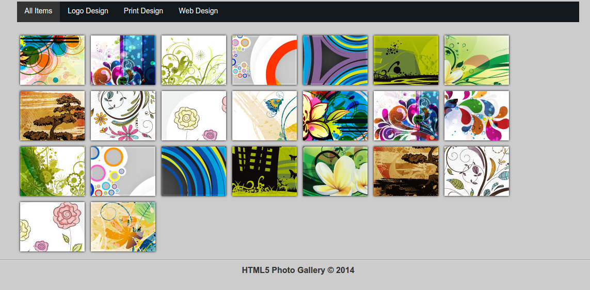

# animated-image-gallery
- It's all about HTML5
- QuickSand plugin is used [QuickSand plug-in](http://razorjack.net/quicksand/) is used for fluent animated filtering
- Fancybox plugin is used for popup and moving through images

We have a nice and neat gallery. By clicking on each category, we'll see the images inthat category

And by clicking on each image, that image will pop up with  the capability of scrolling among images.

I am not good at jQuery, and my main focus is currenctly is on AngularJS, but I tried to solved this challenge by the help of online materials e.g. stackoverflow, udemy tutorials, etc
